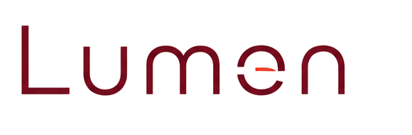

<div align="center">



### LOGO Tiger için modern, mobil uyumlu sipariş & stok yönetim ön yüzü

[](LICENSE)
[](https://www.php.net/)
[](https://www.microsoft.com/sql-server)
[](#gereksinimler)
[](#üretimde-kullanılıyor)

</div>

---

## English (Summary)

**Lumen** is a modern, mobile-friendly web front-end for businesses running **LOGO Tiger ERP**. It runs on top of your existing LOGO SQL Server database and provides a fast sales-terminal experience — order entry, customer/stock lookup, balances, cheques, multi-currency and reporting — in Turkish, on any device.

Lumen does **not** replace LOGO Tiger; it is a companion interface. Open source under the **MIT** license. First-time setup is a browser wizard (`/kurulum.php`). Ships with a synthetic demo so you can try it without touching production data.

**Used in production** at [AKEL Melamin](https://github.com/akel-melamin) — a Turkish melamine tableware manufacturer — for daily order entry, stock lookup and collections on a live LOGO Tiger installation. This repository is the de-branded, configurable open-source edition of that same codebase.

> ⚠️ Requires an existing **LOGO Tiger** installation on **Microsoft SQL Server** (with the `pdo_sqlsrv` PHP driver).

---

## İçindekiler

- [Lumen Nedir?](#lumen-nedir)
- [Üretimde Kullanılıyor](#üretimde-kullanılıyor)
- [Özellikler](#özellikler)
- [Gereksinimler](#gereksinimler)
- [Kurulum](#kurulum)
- [Demo Veritabanı](#demo-veritabanı)
- [Yapılandırma](#yapılandırma)
- [Kendi Markanız](#kendi-markanız)
- [Güvenlik](#güvenlik)
- [Katkıda Bulunma](#katkıda-bulunma)
- [Lisans](#lisans)

## Lumen Nedir?

Lumen, **LOGO Tiger ERP** kullanan firmalar için tasarlanmış, web tabanlı bir **sipariş ve stok yönetim ön yüzüdür**. Verinin kaynağı LOGO'nun kendi SQL Server veritabanıdır; Lumen bu veritabanı üzerine hızlı, sade ve **mobil uyumlu** bir satış terminali arayüzü koyar.

Amaç: satış temsilcilerinin ve mağaza personelinin sipariş girişi, cari/stok sorgulama ve tahsilat gibi günlük işlemleri telefondan veya tabletten, LOGO'nun masaüstü istemcisine ihtiyaç duymadan yapabilmesi. LOGO bağımlılığı kalıcıdır — Lumen LOGO'nun yerini almaz, onu tamamlar.

## Üretimde Kullanılıyor

Lumen bir demo ya da kavram kanıtı değil: temelini oluşturan sistem **[AKEL Melamin](https://github.com/akel-melamin)** bünyesinde, LOGO Tiger üzerinde canlı bir kurulumda her gün gerçek sipariş, stok ve tahsilat işlemleri için kullanılıyor.

Bu depo, aynı kod tabanının **markasızlaştırılmış ve yapılandırılabilir** açık kaynak sürümüdür — firmaya özel değerler (ürün kodu ön eki, mağaza carisi, marka, yetkiler) koddan çıkarılıp ayar dosyalarına taşınmıştır. Yani üretimde denenmiş akışları, kendi LOGO veritabanınıza kurup kullanabilirsiniz.

## Özellikler

- 🧾 **Sipariş girişi** — hızlı çoklu satır, kademeli iskonto, KDV, döviz, koli/adet
- 👥 **Cari yönetimi** — bakiye, ekstre, Türkçe-duyarlı arama, cari işlemleri merkezi
- 📦 **Stok** — anlık miktar (LOGO view'larından), fiyat, birim/koli, barkod
- 💳 **Çek yönetimi** — giriş/çıkış/ciro, portföy takibi, çeke görsel ek
- 💱 **Döviz işlemleri** — çoklu kur, dövizli sipariş
- 💰 **Kasa & tahsilat**, **fatura** akışları
- 📊 **Raporlar** — satış, cari yaşlandırma, kâr-zarar, çek, KDV, pazarlamacı performansı
- 🏷️ **Barkod / etiket** üretimi
- ✅ **Görev takibi**
- 📱 **Mobil uyumlu + PWA** — telefona kısayol olarak eklenebilir
- 🎨 **Kişiselleştirme** — kullanıcı bazlı vurgu rengi, yazı boyutu, "müşteri yanında" gizli mod
- 🔐 **Rol bazlı yetki** — yönetici / personel / müşteri; kod bazlı ekran izinleri
- 🧙 **Kurulum sihirbazı** — tarayıcıdan DB bağlantısı + ilk yönetici
- 🖼️ **Kendi logonuz** — ayarlardan yükleyin

## Gereksinimler

- **LOGO Tiger** kurulu bir **Microsoft SQL Server** veritabanı
- **PHP 8.0+** ve `pdo_sqlsrv` sürücüsü ([Microsoft Drivers for PHP for SQL Server](https://learn.microsoft.com/sql/connect/php/download-drivers-php-sql-server))
- Web sunucusu: IIS (FastCGI) veya Apache/nginx
- [Composer](https://getcomposer.org/) (bağımlılıklar için)

## Kurulum

```bash
# 1) Depoyu alın
git clone https://github.com/husodrn46/Lumen.git
cd Lumen

# 2) Bağımlılıkları kurun
composer install

# 3) Web sunucunuzu bu klasöre yönlendirin (veya hızlı deneme):
php -S localhost:8000
```

Ardından tarayıcıdan **`http://localhost:8000/kurulum.php`** adresini açın ve sihirbazı izleyin:

1. **Veritabanı** — SQL Server adresi, veritabanı adı, kullanıcı/parola + firma/dönem numarası. Lumen bağlantıyı test edip `.env` ve `_baglanti_.inc` dosyalarını oluşturur.
2. **Yönetici** — LOGO'daki mevcut bir satış temsilcisi kodunu seçip parola belirleyin.

Kurulum bitince sihirbaz kilitlenir (`.installed`). Artık `giris.php` üzerinden giriş yapabilirsiniz.

> Elle kurulum: `.env.example` → `.env` ve `_baglanti_.inc.example` → `_baglanti_.inc` kopyalayıp değerleri doldurun.

## Demo Veritabanı

LOGO lisansınız olmadan denemek ister misiniz? `sql/` altındaki şema betiklerinden yola çıkarak sentetik bir demo veritabanı oluşturabilir; Lumen'in tüm çekirdek ekranlarını gerçek veriye dokunmadan görebilirsiniz. (Demo verisi tamamen uydurmadır; gerçek müşteri/ürün bilgisi içermez.)

## Yapılandırma

| Dosya | Amaç |
|------|------|
| `.env` | DB bağlantısı, firma/dönem önekleri, mağaza carisi, log kökü (gizli — git'e girmez) |
| `_baglanti_.inc` | `.env`'i okuyan bağlantı katmanı |
| `_bilgi_.inc` | Özellik bayrakları ve varsayılanlar (döviz, çoklu depo, çek, mağaza satışı…) |

Öne çıkan ayarlar: `MAGAZA_CARI` (mağaza hızlı satış carisi, 0 = kapalı), `$dovizlicalis`, `$cokludepo`, `$urun_kodu_oneki` (raporları belirli bir ürün kodu ön ekiyle sınırlar; boş = tüm ürünler). Loglar `.env` `LOG_ROOT` verilmezse `logs/` klasörüne yazılır.

## Kendi Markanız

Ayarlar → **Marka / Logo** ekranından kendi yatay logonuzu ve uygulama ikonunuzu yükleyebilirsiniz (PNG/JPG/WEBP; sunucuda güvenli şekilde yeniden kodlanır). Vurgu rengi `--red` CSS değişkeniyle yönetilir.

## Güvenlik

- Tüm korumalı sayfalarda oturum + yetki denetimi (`kontrol.php`)
- Durum değiştiren isteklerde CSRF token
- Parolalar `password_hash` (bcrypt) ile saklanır
- Tüm sorgular PDO prepared statement; çıktıda `htmlspecialchars`
- Oturum sabitleme koruması, HttpOnly + SameSite=Strict çerezler
- Gizli bilgiler `.env` / `_baglanti_.inc` içinde tutulur ve `.gitignore` ile korunur

Güvenlik açığı bildirmek için lütfen bir **issue** açın (hassas konularda ayrıntıyı özel paylaşın).

## Katkıda Bulunma

Katkılar memnuniyetle karşılanır. Değişiklikten önce:

```bash
bash scripts/validate.sh     # sözdizim denetimi + sağlık taraması
php -l path/to/file.php       # tek dosya
```

Yeni PHP dosyalarında `declare(strict_types=1);` kullanın, mevcut kod stiline uyun, sorgularda daima prepared statement tercih edin.

## Lisans

[MIT](LICENSE) © husodrn46

> "LOGO" ve "Tiger", LOGO Yazılım'ın tescilli markalarıdır. Lumen bağımsız, üçüncü taraf bir açık kaynak projesidir ve LOGO Yazılım ile herhangi bir bağı yoktur.
